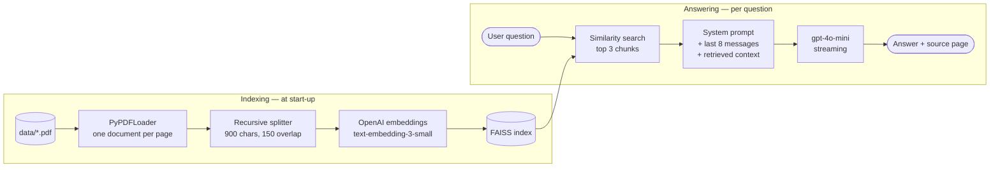

<p align="center">
  
</p>

# Bilingual RAG Assistant with Source Citations


A retrieval-augmented generation (RAG) assistant that answers in **Arabic and English** from a PDF
knowledge base and cites the document and page each answer came from.

It was built as the support assistant of **AuraHome**, an IoT and AI-based smart home security
system developed as a senior graduation project, where it takes the place of human first-line
support: users ask about the mobile app or the hardware, and the assistant answers from the
project's own documentation.

## Table of contents

- [Features](#features)
- [How it works](#how-it-works)
- [Tech stack](#tech-stack)
- [Project structure](#project-structure)
- [Installation](#installation)
- [Usage](#usage)
- [Configuration](#configuration)
- [Using your own documents](#using-your-own-documents)
- [Limitations](#limitations)
- [Related project](#related-project)
- [License](#license)

## Features

- **Grounded answers** — every reply is generated from passages retrieved from the knowledge base,
  not from the model's general knowledge. When the documents do not contain the answer, the
  assistant is instructed to say so.
- **Source attribution** — each answer comes with a "where did this come from?" panel naming the
  source file, the PDF page, and the page number printed in the document when it can be read from
  the page footer.
- **Bilingual** — replies in Arabic when asked in Arabic, otherwise in the user's language. The
  support guide itself is written in both languages.
- **Conversation memory** — the last 8 messages are sent with each question, so follow-up questions
  work.
- **Streaming chat interface** — answers appear token by token in a Streamlit chat UI.
- **Prompt-injection guard** — retrieved text is passed to the model as untrusted reference
  material, with an explicit rule never to follow instructions found inside it.

## How it works



1. **Indexing.** At start-up every PDF in `data/` is loaded page by page, split into overlapping
   chunks of 900 characters, embedded, and stored in a FAISS index. The index is rebuilt on every
   start, so it always matches the current content of `data/`.
2. **Retrieval.** The question is embedded and the 3 most similar chunks are retrieved. Each chunk
   keeps its file name and page number.
3. **Generation.** The model receives a system prompt with the assistant's rules, the recent
   conversation, and the retrieved chunks labelled with their source. The answer is streamed back
   to the interface.
4. **Attribution.** The top-ranked chunk is shown as the source: file name, PDF page, and the
   printed page number recovered from the page text.

### Knowledge base

| File | Content |
|---|---|
| `data/aurahome-project-report.pdf` | Senior project report, *An IoT and AI-Based Smart Home Security and Safety System* (146 pages): system design, hardware circuits, AI modules |
| `data/aurahome-app-support-guide.pdf` | Mobile app support guide (41 pages): question-and-answer format, in English and Arabic |

## Tech stack

| Layer | Technology |
|---|---|
| Interface | [Streamlit](https://streamlit.io/) chat components |
| Orchestration | [LangChain](https://www.langchain.com/) (`langchain-core`, `langchain-community`, `langchain-openai`, `langchain-text-splitters`) |
| PDF parsing | `pypdf` through LangChain's `PyPDFLoader` |
| Chunking | `RecursiveCharacterTextSplitter` |
| Embeddings | OpenAI `text-embedding-3-small` |
| Vector store | [FAISS](https://github.com/facebookresearch/faiss) (`faiss-cpu`) |
| Language model | OpenAI `gpt-4o-mini`, temperature 0.2, streaming |
| Configuration | `python-dotenv` |
| Language | Python 3.10 |

## Project structure

```
bilingual-rag-assistant/
├── src/
│   ├── app.py            # Streamlit chat interface
│   ├── rag.py            # loading, indexing, retrieval, prompt, source formatting
│   └── config.py         # paths, model names, retrieval settings
├── data/                 # PDF knowledge base
│   ├── aurahome-project-report.pdf
│   └── aurahome-app-support-guide.pdf
├── assets/               # logo shown in the app and in this README
├── .env.example          # template for the API key
├── requirements.txt
├── LICENSE
└── README.md
```

## Installation

The project was developed with **Python 3.10 on Windows**. You need an
[OpenAI API key](https://platform.openai.com/api-keys).

```bash
git clone https://github.com/Abdulkarem-SHAHEN/bilingual-rag-assistant.git
cd bilingual-rag-assistant

python -m venv venv
venv\Scripts\activate            # Windows
# source venv/bin/activate       # Linux / macOS

pip install -r requirements.txt
```

Then create the `.env` file from the template and paste your key into it:

```bash
copy .env.example .env           # Windows
# cp .env.example .env           # Linux / macOS
```

```
OPENAI_API_KEY=your-openai-api-key
```

`.env` is listed in `.gitignore` and must never be committed.

## Usage

Run from the repository root:

```bash
streamlit run src/app.py
```

The app opens at http://localhost:8501. The first screen takes a few seconds while the index is
built. Then type a question, for example:

- `How do I add a new device in the app?`
- `ما هي الحساسات المستخدمة في النظام؟`
- `How does the face recognition door lock work?`

Open **📌 من أين جاء الجواب؟** under an answer to see its source, shown as the file name with the
report's printed page and the PDF page. The sidebar lists the indexed files and has a button to
clear the conversation.

The interface labels are in Arabic, the language of the app's users.

## Configuration

All settings are in [`src/config.py`](src/config.py):

| Setting | Default | Meaning |
|---|---|---|
| `EMBEDDING_MODEL` | `text-embedding-3-small` | Model used to embed chunks and questions |
| `CHAT_MODEL` | `gpt-4o-mini` | Model that writes the answer |
| `TEMPERATURE` | `0.2` | Low value, to keep answers close to the documents |
| `MAX_TOKENS` | `600` | Maximum length of an answer |
| `K_RETRIEVE` | `3` | Chunks retrieved per question |
| `CHUNK_SIZE` / `CHUNK_OVERLAP` | `900` / `150` | Chunking, in characters |
| `CONTEXT_CLIP` | `1200` | Maximum characters kept from each retrieved chunk |
| `HISTORY_WINDOW` | `8` | Previous messages sent with each question |

## Using your own documents

Replace the files in `data/` with your own PDFs and restart the app. The index is rebuilt from
whatever is in the folder, and the sidebar shows the files that were indexed. To rename the
assistant, edit the system prompt in `build_system_prompt()` in [`src/rag.py`](src/rag.py).

## Limitations

- The index is rebuilt at every start, which calls the embeddings API each time. This is fine for a
  small knowledge base like this one; a larger one should load the saved index instead.
- Only the top-ranked chunk is shown as the source, even though three are sent to the model.
- Only the text layer of the PDFs is indexed. Figures, circuit diagrams and scanned pages are not
  searchable.
- Answers require an internet connection and an OpenAI account with available credit.

## Related project

The face recognition door access module of the same system:
[anti-spoofing-face-recognition](https://github.com/Abdulkarem-SHAHEN/anti-spoofing-face-recognition).

## License

Released under the [MIT License](LICENSE).
